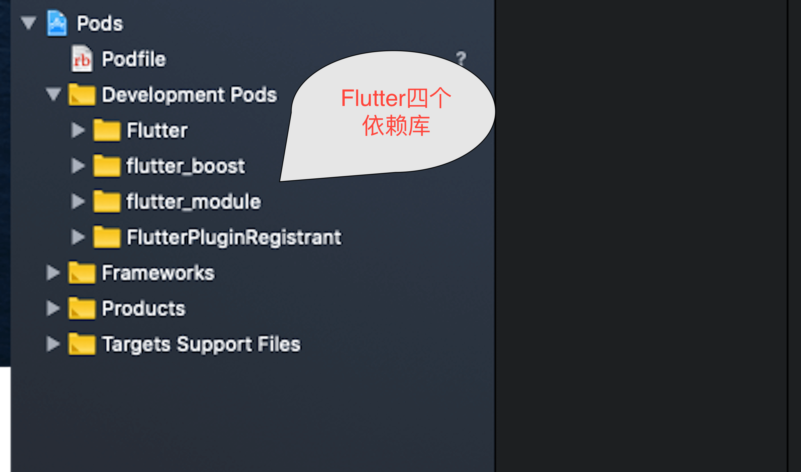

# flutter混编项目

使用flutter_boost框架完成现有iOS工程混编Flutter

flutter_boost : https://github.com/alibaba/flutter_boost

## 优缺点

一：优点：

1、执行方便，在Xcode执行编译就可以自动云心脚本集成dart和plugin；

2、编译方便，修改flutter文件，可以在xcode工程中立马拿到最新代码快速迭代开发，而无需在xcode意外执行额外的命令；

3、可联机动态更新flutter中的页面（hot reload）；

二：缺点：

1、项目中每个人都要配置对应的flutter和dart的环境；

2、项目配置都要修改flutter和dart的路径，每个人的配置路径还不同；

3、git 代码不好管理，每次提交都会把配置信息和路径信息一起上传，冲突较多；

4、你的应用不能在模拟器上运行release模式，因为Flutter还不支持将Dart代码编译成x86 ahead-of-time（AOT）模式的二进制文件。你可以在模拟器和真机上运行Debug，在真机上运行Release模式。

## 集成步骤

1、创建Flutter module命令行或者编译器创建，最好和你的Xcode工程在同一级目录下；                                  

 cd 你的xcode目录

 flutter create —template/-t module flutterModule项目名称

2、添加依赖包到flutter中，在pubspec.yaml文件中添加自己的依赖，包括Flutter packages和plugins，目录中 .ios/隐藏文件夹下包含一个Xcode workspace，用于单独运行你的Flutter module。它是一个独立启动Flutter代码的壳工程，并且包含一个帮助脚本，用于编译frameworks或者使用CocoaPods将Flutter module集成到你的项目中；

3、iOS工程已有Podfile的话添加一下内容，没有重新创建：

        platform:ios,'9.0'

        target 'FlutterBoostDemo' do

        flutter_application_path = '../flutter_module'

        load File.join(flutter_application_path, '.ios', 'Flutter', 'podhelper.rb')

        install_all_flutter_pods(flutter_application_path)

        end

        post_install do |installer|

          installer.pods_project.targets.each do |target|

            target.build_configurations.each do |config|
                #Flutter混编暂不支持Bitcode
     
            config.build_settings['ENABLE_BITCODE'] = 'NO'

            end

          end

        end
4、运行pod install

5、当你在my_flutter/pubspec.yaml改变了Flutter plugin依赖，需要在Flutter module目录运行flutter pub get，来更新会被podhelper.rb脚本用到的plugin列表，然后再次在你的应用目录some/path/MyApp运行pod install。podhelper.rb脚本会把你的plugins，Flutter.framework，和App.framework集成到你的项目中。

### 注意点：
1、Swift项目需要创建 Runner-Bridging-Header.h文件，并且

        #import "GeneratedPluginRegistrant.h"
        #import <flutter_boost/FlutterBoost.h>

2、并在BuildSetting-->Objective-C Bridging Header 设置编译文件位置 FlutterBoostDemo/Runner-Bridging-Header.h

3、完成后需要主动将AppDelegate.swift中的代码遵循FlutterAppDelegate并主动注册；

        GeneratedPluginRegistrant.register(with: self);

4、更新flutter代码如果结果没显示，重新Pod install一下；

5、 flutter单独的工程可以在flutter_module下的.ios下运行单独进行编译；

6、由于flutter_module和iOS工程在每位开发人员电脑的路径不一样，所以编译结果会出错，只需删除同目录下生成的User文件重新pod install生成最新的目录即可，同样，如若工程在本地发生变动也需要pod install更新。